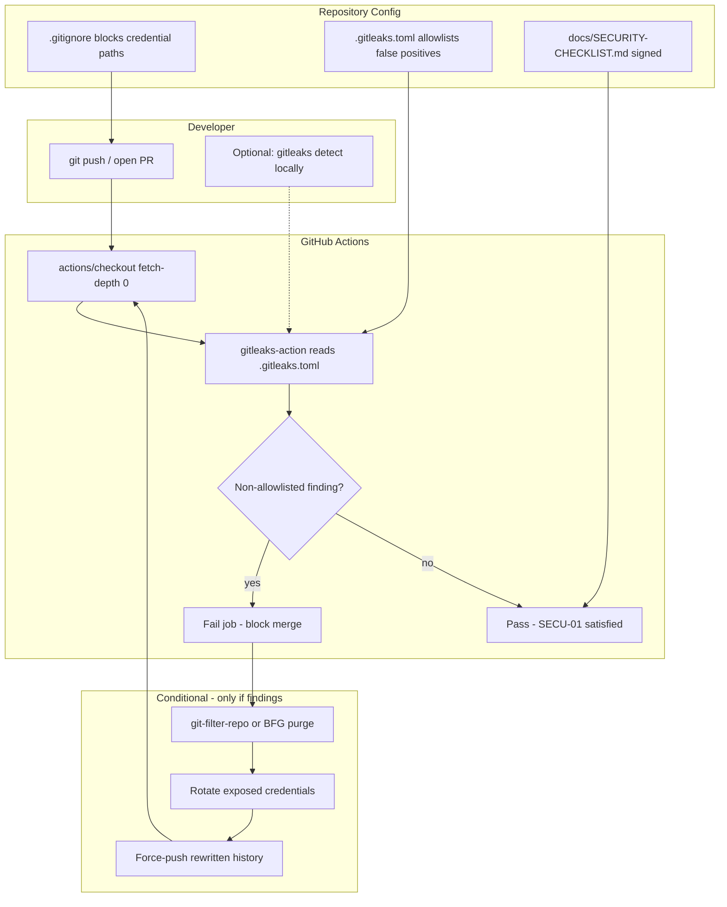

# Phase 7: Security & Git Hygiene - Research

**Researched:** 2026-07-25
**Domain:** Git secrets scanning, Android credential gitignore hardening, pre-public security checklist
**Confidence:** HIGH

## Summary

Phase 7 hardens the Simmärken repository before any public visibility. The repo is in a favorable starting state: a local baseline scan with Gitleaks 8.30.1 across 169 commits (~1.87 MB) returned **zero findings**, and no signing/credential files (`*.jks`, `*.keystore`, `keystore.properties`, `play-credentials.json`, `service-account*.json`) appear anywhere in git history. `local.properties` is gitignored and was never committed.

Deliverables are infrastructure-only: hardened `.gitignore` (SECU-03), root `.gitleaks.toml` with explicit false-positive allowlists, the first GitHub Actions workflow (Gitleaks on push/PR with `fetch-depth: 0`, SECU-01), and a completed `docs/SECURITY-CHECKLIST.md` with maintainer sign-off (SECU-02). No app code changes are expected.

History rewrite (BFG or `git-filter-repo`) is a **conditional** playbook, not the default path — required only if Gitleaks finds confirmed real secrets. Given the clean baseline, the planner should prioritize config + CI + checklist, with remediation steps gated behind a "findings detected" branch.

**Primary recommendation:** Ship a minimal Gitleaks CI workflow (`gitleaks/gitleaks-action@v3` + `actions/checkout@v6` + `fetch-depth: 0`), extend default Gitleaks rules with a path allowlist for `local.properties`, harden `.gitignore` for Android signing/credential patterns, and complete the five-item security checklist — then re-run full-history scan locally and in CI to confirm zero non-allowlisted findings.

## Architectural Responsibility Map

| Capability | Primary Tier | Secondary Tier | Rationale |
|------------|-------------|----------------|-----------|
| Secrets detection (Gitleaks) | CI/CD (GitHub Actions) | Local CLI (maintainer verification) | SECU-01 requires automated scan on every push/PR; local `gitleaks detect` is the pre-merge sanity check |
| False-positive allowlisting | Repo config (`.gitleaks.toml`) | — | Allowlist is version-controlled policy; CI auto-detects root config |
| Credential file blocking | Repo config (`.gitignore`) | — | SECU-03 prevents accidental `git add` of signing/credential files before Phase 8–11 introduce them locally |
| History remediation | Maintainer ops (git-filter-repo) | — | Only if confirmed secrets exist in history; not app-tier logic |
| Pre-public security review | Documentation (`docs/SECURITY-CHECKLIST.md`) | Maintainer sign-off | SECU-02 is a human gate, not automatable |
| Export JSON privacy review | Documentation (checklist item) | App schema (`BackupDto`) | Checklist verifies export contains only expected child-name PII, not unexpected fields |

<user_constraints>
## User Constraints (from CONTEXT.md)

### Locked Decisions

#### History Remediation
- **D-01:** Zero tolerance for real secrets in git history — any confirmed secret must be purged (BFG/filter-repo) or rotated before public release; no "it's old" exceptions.
- **D-02:** Prefer history rewrite first — use BFG or git-filter-repo to remove confirmed secrets from all commits; rotate credentials if they were ever live/active.
- **D-03:** Public-release gate is hard-blocked — Phase 12 (OSS-05) cannot proceed until full-history Gitleaks scan is clean; no risk-acceptance workaround.
- **D-04:** `local.properties` is low-risk — SDK paths and machine-specific entries are not secrets; allowlist in `.gitleaks.toml` if found in history rather than rewriting for those alone.

#### Security Checklist (SECU-02)
- **D-05:** Checklist scope is "release readiness" — beyond secrets: signing files not in repo, no service account JSON tracked, badge asset licensing documented, export JSON privacy review.
- **D-06:** Solo maintainer self-sign — maintainer checks all items and signs off with name + date directly in `docs/SECURITY-CHECKLIST.md`.
- **D-07:** Core checklist items for v1.1: (1) Gitleaks clean on full history, (2) `.gitignore` covers signing/credential files, (3) no service account JSON in repo, (4) badge asset licensing documented per `docs/SOURCES.md`, (5) export JSON contains no unexpected PII.
- **D-08:** Checklist completion is a Phase 7 gate — filled and signed in Phase 7; Phase 12 only re-verifies SECU-01 still passes on `main` before visibility change.

#### Gitleaks CI & Strictness
- **D-09:** Workflow fails on any finding — Gitleaks GitHub Actions job fails push/PR on any non-allowlisted finding; aligns with SECU-01 zero-findings requirement.
- **D-10:** `.gitleaks.toml` allowlist for false positives — explicit allowlist entries (including `local.properties` path patterns); everything else must be zero findings.
- **D-11:** Full history on every CI run — `fetch-depth: 0` on push and PR; no diff-only optimization.
- **D-12:** CI-only enforcement — no mandatory local pre-commit hook; Gitleaks runs in GitHub Actions only (solo-maintainer simplicity).

#### Gitignore (SECU-03 — not discussed; from requirements)
- **D-13:** Standard Android signing/credential patterns per ROADMAP success criteria — block at minimum: `*.jks`, `*.keystore`, `keystore.properties`, `**/play-credentials.json`, `**/service-account*.json`, `local.properties` (already present). Planner may add adjacent patterns (e.g. `*.p12`, `google-services.json` if ever introduced) without re-discussion.

### Claude's Discretion
- Exact `.gitleaks.toml` allowlist rule syntax for `local.properties` fingerprints.
- Choice between BFG Repo-Cleaner vs `git-filter-repo` if history rewrite is needed.
- Specific `.gitignore` pattern ordering and comments.
- Gitleaks GitHub Action version pin and workflow file structure (delegated to Phase 9 overlap boundary — Phase 7 owns the gitleaks workflow specifically).

### Deferred Ideas (OUT OF SCOPE)
None — discussion stayed within phase scope. Gitignore pattern details deferred to planner per D-13 (requirements-driven, not user-discussed).
</user_constraints>

<phase_requirements>
## Phase Requirements

| ID | Description | Research Support |
|----|-------------|------------------|
| SECU-01 | Automated secrets scan (gitleaks) passes with zero findings on full git history | Baseline scan clean (169 commits, 0 findings). Use `gitleaks/gitleaks-action@v3` with `fetch-depth: 0`. Root `.gitleaks.toml` with `[extend] useDefault = true` and path allowlist for `local.properties`. |
| SECU-02 | Manual pre-public security review checklist completed and signed off | Create `docs/SECURITY-CHECKLIST.md` with five D-07 items; maintainer signs name + date in-file. Badge licensing cross-ref `docs/SOURCES.md`; export PII scope defined by `BackupDto` schema. |
| SECU-03 | `.gitignore` hardened for keystores, Play credentials, and local signing files | Current `.gitignore` only blocks `local.properties`. Add D-13 patterns plus optional `*.p12`, `google-services.json`. Verify with `git check-ignore`. |
</phase_requirements>

## Project Constraints (from .cursor/rules/)

No `.cursor/rules/` directory exists in this repository. No project-specific Cursor rule directives apply beyond user-level rules (solo-maintainer, infrastructure-only v1.1, no commits unless requested).

## Standard Stack

### Core

| Tool / Action | Version | Purpose | Why Standard |
|---------------|---------|---------|--------------|
| Gitleaks CLI | 8.30.1 [VERIFIED: local `gitleaks version`] | Full-history secrets scan | Locked in PROJECT.md and CONTEXT.md (D-09–D-12); industry-standard SAST for git secrets |
| `gitleaks/gitleaks-action` | v3 [CITED: github.com/gitleaks/gitleaks-action] | CI secrets scan on push/PR | Official action; Node 24 runtime; auto-detects root `.gitleaks.toml` |
| `actions/checkout` | v6 [CITED: github.com/gitleaks/gitleaks-action] | Full clone for history scan | Required `fetch-depth: 0` for SECU-01/D-11 |
| `git-filter-repo` | a40bce548d2c [VERIFIED: local `git-filter-repo --version`] | History rewrite if secrets found | Recommended over BFG for string/secret replacement [CITED: github.com/newren/git-filter-repo] |

### Supporting

| Tool | Version | Purpose | When to Use |
|------|---------|---------|-------------|
| BFG Repo-Cleaner | — (Java available, BFG not installed) | Fast file/blob purge | Only if large binary secrets need removal; less flexible than filter-repo [CITED: rtyley.github.io/bfg-repo-cleaner] |
| `git check-ignore -v` | git built-in | Verify `.gitignore` coverage | After SECU-03 hardening |

### Alternatives Considered

| Instead of | Could Use | Tradeoff |
|------------|-----------|----------|
| Gitleaks | TruffleHog | Rejected — locked decision in PROJECT.md |
| `git-filter-repo` | BFG | BFG faster for large files; filter-repo better for secret strings and complex rewrites (D-02 discretion favors filter-repo) |
| CI-only Gitleaks | Pre-commit hook | Rejected per D-12 (solo-maintainer simplicity) |

**Installation (maintainer local verification):**

```bash
brew install gitleaks    # 8.30.1 verified 2026-07-25
brew install git-filter-repo  # already installed on research machine
```

**Version verification:** Gitleaks 8.30.1 confirmed via `gitleaks version` after `brew install gitleaks`. `gitleaks-action@v3` pins a default Gitleaks version internally; override with `GITLEAKS_VERSION` env if needed [CITED: github.com/gitleaks/gitleaks-action README].

## Package Legitimacy Audit

> Phase 7 does not add npm/PyPI/crates dependencies. External surface is Homebrew binaries and GitHub Marketplace actions.

| Package / Action | Registry | Age | Downloads | Source Repo | Verdict | Disposition |
|----------------|----------|-----|-----------|-------------|---------|-------------|
| gitleaks (brew) | Homebrew | 8+ yrs | High | github.com/gitleaks/gitleaks | OK | Approved — official tool |
| git-filter-repo (brew) | Homebrew | 5+ yrs | High | github.com/newren/git-filter-repo | OK | Approved |
| gitleaks/gitleaks-action@v3 | GitHub Marketplace | 3+ yrs | 622★ | github.com/gitleaks/gitleaks-action | OK | Approved — pin to `@v3` |
| actions/checkout@v6 | GitHub Marketplace | — | — | github.com/actions/checkout | OK | Approved |

**Packages removed due to [SLOP] verdict:** none
**Packages flagged as suspicious [SUS]:** none

## Architecture Patterns

### System Architecture Diagram



### Recommended Project Structure

```
.github/
└── workflows/
    └── gitleaks.yml          # SECU-01 — first workflow; Phase 9 adds lint/test separately
.gitleaks.toml                # Extend defaults + path allowlist (D-10)
.gitignore                    # SECU-03 hardened patterns
docs/
├── SECURITY-CHECKLIST.md     # SECU-02 — new artifact with sign-off block
└── SOURCES.md                # Existing — referenced by checklist item 4
```

### Pattern 1: Gitleaks CI Workflow (full history)

**What:** Checkout full history, run Gitleaks with repo config, fail on any non-allowlisted finding.
**When to use:** Every push and pull_request (D-09, D-11, D-12).

```yaml
# Source: https://github.com/gitleaks/gitleaks-action (README)
name: gitleaks
on:
  pull_request:
  push:
jobs:
  scan:
    name: gitleaks
    runs-on: ubuntu-latest
    steps:
      - uses: actions/checkout@v6
        with:
          fetch-depth: 0
      - uses: gitleaks/gitleaks-action@v3
        env:
          GITHUB_TOKEN: ${{ secrets.GITHUB_TOKEN }}
          # GITLEAKS_LICENSE not required for personal accounts
```

### Pattern 2: Gitleaks Config with Path Allowlist

**What:** Extend default rules; globally allowlist `local.properties` path pattern (D-04, D-10).
**When to use:** Always — even though `local.properties` is not in history today, defensive allowlist prevents future false positives if accidentally committed.

```toml
# Source: https://github.com/gitleaks/gitleaks (configuration docs)
[extend]
useDefault = true

[[allowlists]]
description = "Android local SDK paths — not secrets (D-04)"
paths = [
  '''(?:^|/)local\.properties$''',
]
```

### Pattern 3: Android Credential Gitignore Block

**What:** Prevent tracking of signing keys and Play/service-account credentials (SECU-03, D-13).
**When to use:** Before Phase 8 introduces `keystore.properties` locally.

```gitignore
# Android signing & Play credentials (SECU-03)
*.jks
*.keystore
keystore.properties
**/play-credentials.json
**/service-account*.json
/local.properties

# Optional adjacent patterns (planner discretion per D-13)
*.p12
google-services.json
```

### Pattern 4: Security Checklist Sign-Off

**What:** Five-item release-readiness checklist with maintainer attestation (D-05–D-07).
**When to use:** Phase 7 completion gate; Phase 12 re-checks SECU-01 only.

Suggested structure for `docs/SECURITY-CHECKLIST.md`:

```markdown
# Pre-Public Security Checklist

| # | Item | Status | Evidence |
|---|------|--------|----------|
| 1 | Gitleaks clean on full git history | [ ] | CI run URL / `gitleaks detect` output |
| 2 | `.gitignore` covers signing/credential files | [ ] | `git check-ignore -v` output |
| 3 | No service account JSON in repo or history | [ ] | `git log --all -- '**/service-account*.json'` |
| 4 | Badge asset licensing documented | [ ] | `docs/SOURCES.md` reviewed |
| 5 | Export JSON contains no unexpected PII | [ ] | `BackupDto` field review (see below) |

## Export JSON PII Scope (item 5)

Expected fields only: child `name`, `stableId` (UUID), `avatarColorArgb`, progress timestamps/codes.
No email, phone, address, device identifiers, or location data.

## Sign-Off

- [ ] All items verified
- Signed: _________________ Date: _________
```

### Anti-Patterns to Avoid

- **Shallow checkout in Gitleaks CI:** Default `fetch-depth: 1` misses historical secrets — violates D-11 [CITED: github.com/gitleaks/gitleaks-action].
- **Relying on GitHub code-scanning SARIF alone:** Resolved alerts do not remove secrets from history [CITED: gitleaks-action README FAQ].
- **Risk-accepting old secrets:** Violates D-01/D-03 — must purge or rotate.
- **Committing `local.properties` to "fix" allowlist noise:** Use `.gitleaks.toml` path allowlist instead (D-04).
- **Deferring checklist sign-off to Phase 12:** Violates D-08 — sign in Phase 7.

## Don't Hand-Roll

| Problem | Don't Build | Use Instead | Why |
|---------|-------------|-------------|-----|
| Secret pattern detection | Custom regex scripts | Gitleaks default rules + `[extend] useDefault = true` | Thousands of tuned rules; maintenance burden |
| CI secrets scanning | Custom GitHub script | `gitleaks/gitleaks-action@v3` | Handles install, config detection, exit codes |
| History purge | Manual `git rebase` per commit | `git-filter-repo --replace-text` or `--path` | Safer, faster, handles all refs |
| Pre-commit enforcement | Custom hook framework | CI-only Gitleaks (D-12) | Locked decision — avoid hook maintenance |

**Key insight:** Secret scanning and history rewriting are solved problems with mature tooling; custom solutions introduce false negatives and operational risk before a public release.

## Common Pitfalls

### Pitfall 1: Shallow Clone in CI

**What goes wrong:** Gitleaks only scans the latest commit; historical secrets pass CI.
**Why it happens:** `actions/checkout` defaults to `fetch-depth: 1`.
**How to avoid:** Always set `fetch-depth: 0` (D-11).
**Warning signs:** CI passes but `gitleaks detect --source .` locally finds leaks.

### Pititfall 2: Allowlist Too Broad

**What goes wrong:** Real secrets masked by overly permissive path/regex allowlists.
**Why it happens:** Copy-pasting large allowlist blocks from other projects.
**How to avoid:** Allowlist only `local.properties` path pattern; require human review for any additional entries (D-10).
**Warning signs:** Allowlist regex matches credential file names like `service-account.json`.

### Pitfall 3: Gitignore Without Verification

**What goes wrong:** Patterns look correct but don't match actual file paths (e.g. missing `**/` glob).
**Why it happens:** Android projects place keystores in varied locations.
**How to avoid:** Run `git check-ignore -v <path>` for each D-13 pattern after editing.
**Warning signs:** `git add keystore.properties` succeeds without ignore warning.

### Pitfall 4: History Rewrite Without Rotation

**What goes wrong:** Secret removed from git but still valid in production/Play Console.
**Why it happens:** Treating rewrite as sufficient remediation.
**How to avoid:** D-02 requires rotation for any live/active credential; rewrite is complementary.
**Warning signs:** Purged API key still works in external service.

### Pitfall 5: Checklist Treated as Checkbox Theater

**What goes wrong:** Items marked done without evidence (especially export PII and licensing).
**Why it happens:** Rushing to Phase 12.
**How to avoid:** Require evidence column per D-06; review `BackupDto` fields and `docs/SOURCES.md` licensing section explicitly.
**Warning signs:** Checklist signed but `docs/SOURCES.md` licensing section never read.

## Code Examples

### Local Full-History Scan (SECU-01 verification)

```bash
# Verified on this repo 2026-07-25: 169 commits, 0 findings
gitleaks detect --source . --verbose
```

### Verify Gitignore Coverage (SECU-03)

```bash
# After hardening .gitignore — expect match for each path
git check-ignore -v local.properties upload.jks keystore.properties play-credentials.json service-account.json
```

### History Audit for Credential Files

```bash
# Verified empty on this repo 2026-07-25
git log --all --oneline -- '*.jks' '*.keystore' 'keystore.properties' '**/play-credentials.json' '**/service-account*.json' 'local.properties'
```

### Conditional History Rewrite (only if findings)

```bash
# Source: https://github.com/newren/git-filter-repo
# Example: remove a committed credential file from all history
git filter-repo --path secrets/service-account.json --invert-paths

# Example: replace leaked string
echo 'literal:AKIA_EXAMPLE_KEY==>***REMOVED***' > /tmp/replacements.txt
git filter-repo --replace-text /tmp/replacements.txt
# Then: rotate the credential, force-push, notify collaborators to re-clone
```

### Export JSON Expected PII Fields (checklist item 5)

```kotlin
// Source: app/src/main/java/se/simmarken/data/export/BackupDto.kt
@Serializable
data class KidBackupDto(
    val stableId: String,      // UUID — expected
    val name: String,          // child display name — expected PII
    val avatarColorArgb: Int,
    val createdAtEpochMillis: Long,
    val sortOrder: Int,
    val requirementProgress: List<RequirementProgressBackupDto>,
    val badgeProgress: List<BadgeProgressBackupDto>,
)
// Payload excludes catalog seed data and language preference (D-05 in BackupDto KDoc)
```

## State of the Art

| Old Approach | Current Approach | When Changed | Impact |
|--------------|------------------|--------------|--------|
| `git filter-branch` | `git-filter-repo` | 2020+ | filter-branch deprecated; filter-repo faster and safer |
| `[allowlist]` in gitleaks.toml | `[[allowlists]]` | Gitleaks v8.25+ | Use new syntax; old still works [CITED: github.com/gitleaks/gitleaks] |
| `gitleaks-action@v2` (Node 20) | `@v3` (Node 24) | 2026 | v2 deprecated June 2026; removed Sept 2026 [CITED: gitleaks-action README] |
| TruffleHog default | Gitleaks (locked) | v1.1 planning | Project decision — do not switch |

**Deprecated/outdated:**
- `git filter-branch`: Git warns against use; use `git-filter-repo`.
- `gitleaks-action@v2`: Migrate to v3 before Node 20 removal on GitHub-hosted runners.

## Assumptions Log

| # | Claim | Section | Risk if Wrong |
|---|-------|---------|---------------|
| A1 | Repo will be pushed to GitHub (personal account) before Phase 12 | Environment | GITLEAKS_LICENSE not needed; if org account, license required |
| A2 | No remote configured yet — CI workflow won't run until push | Environment | Planner should include "push to GitHub and verify workflow green" as verification step |
| A3 | Baseline clean scan generalizes to CI | Summary | Different Gitleaks version in action could surface new rules — pin `GITLEAKS_VERSION` if drift occurs |
| A4 | `google-services.json` / `*.p12` optional in gitignore | Pattern 3 | Low risk — only needed if Firebase or PKCS12 signing introduced later |

**Note:** Claims verified in this session (local gitleaks scan, git history audit, file inventory) are tagged in body text; assumptions above need no user confirmation unless remote hosting differs from GitHub personal account.

## Open Questions

1. **GitHub remote URL and visibility**
   - What we know: No `git remote` configured on research machine; workflow is greenfield.
   - What's unclear: Exact GitHub repo name and personal vs org account (affects GITLEAKS_LICENSE).
   - Recommendation: Planner adds verification task "push branch, confirm Gitleaks workflow runs green on GitHub." If org account, add `GITLEAKS_LICENSE` secret before first run.

2. **Whether any findings appear under default rules in CI**
   - What we know: Local 8.30.1 scan clean with no custom config.
   - What's unclear: CI action may pin a different Gitleaks version.
   - Recommendation: After adding `.gitleaks.toml`, run local scan with `--config .gitleaks.toml` before pushing.

## Environment Availability

| Dependency | Required By | Available | Version | Fallback |
|------------|------------|-----------|---------|----------|
| Gitleaks CLI | SECU-01 local verification | ✓ | 8.30.1 | `brew install gitleaks` |
| git-filter-repo | D-02 history remediation | ✓ | a40bce548d2c | `brew install git-filter-repo` |
| BFG Repo-Cleaner | D-02 alternative | ✗ | — | Use git-filter-repo (recommended) |
| Java (for BFG) | BFG only | ✓ | system `/usr/bin/java` | N/A if using filter-repo |
| GitHub Actions | SECU-01 CI | ✗ (no remote) | — | Push repo to GitHub; workflow file ready |
| GitHub personal account | GITLEAKS_LICENSE exemption | [ASSUMED] | — | If org: obtain free license at gitleaks.io |

**Missing dependencies with no fallback:**
- GitHub remote/hosting — required for CI enforcement (D-12); workflow file can be committed locally but won't execute until pushed.

**Missing dependencies with fallback:**
- BFG — use `git-filter-repo` instead (preferred per research).

## Validation Architecture

### Test Framework

| Property | Value |
|----------|-------|
| Framework | No phase-specific unit tests — infrastructure/config phase |
| Config file | `.gitleaks.toml` (to be created) |
| Quick run command | `gitleaks detect --source . --config .gitleaks.toml` |
| Full suite command | Same + GitHub Actions workflow on push/PR |

Existing app test infrastructure (JUnit 4 + Robolectric, `app/src/test/`) is unchanged in Phase 7. Verification is command-based and checklist-based.

### Phase Requirements → Test Map

| Req ID | Behavior | Test Type | Automated Command | File Exists? |
|--------|----------|-----------|-------------------|-------------|
| SECU-01 | Full-history Gitleaks zero findings | integration (CLI) | `gitleaks detect --source . --config .gitleaks.toml --verbose` | ❌ Wave 0 — create `.gitleaks.toml` |
| SECU-01 | CI Gitleaks on push/PR | CI | GitHub Actions `gitleaks.yml` green | ❌ Wave 0 — create workflow |
| SECU-02 | Security checklist signed | manual | Review `docs/SECURITY-CHECKLIST.md` sign-off block | ❌ Wave 0 — create checklist |
| SECU-03 | Credential paths gitignored | smoke | `git check-ignore -v upload.jks keystore.properties play-credentials.json service-account.json local.properties` | ❌ Wave 0 — extend `.gitignore` |

### Sampling Rate

- **Per task commit:** `gitleaks detect --source . --config .gitleaks.toml`
- **Per wave merge:** `git check-ignore` smoke + local full-history scan
- **Phase gate:** CI workflow green on `main` + checklist signed

### Wave 0 Gaps

- [ ] `.gitleaks.toml` — Gitleaks config with `local.properties` allowlist
- [ ] `.github/workflows/gitleaks.yml` — SECU-01 CI workflow
- [ ] `.gitignore` — SECU-03 credential patterns
- [ ] `docs/SECURITY-CHECKLIST.md` — SECU-02 checklist with sign-off
- [ ] GitHub remote + first workflow run — CI verification (blocked until push)

## Security Domain

### Applicable ASVS Categories

| ASVS Category | Applies | Standard Control |
|---------------|---------|------------------|
| V2 Authentication | no | N/A — no auth system in repo |
| V3 Session Management | no | N/A |
| V4 Access Control | yes | Credential files excluded from VCS via `.gitignore`; secrets in GitHub Secrets only (Phase 11) |
| V5 Input Validation | no | No runtime input in this phase |
| V6 Cryptography | yes | Signing keys (`*.jks`, `keystore.properties`) must never be committed; enforce via gitignore + Gitleaks |

### Known Threat Patterns for {stack}

| Pattern | STRIDE | Standard Mitigation |
|---------|--------|---------------------|
| Hardcoded API keys / tokens in source | Information Disclosure | Gitleaks default rules + CI (SECU-01) |
| Accidental keystore commit | Information Disclosure | `.gitignore` patterns (SECU-03) |
| Play service account JSON in repo | Information Disclosure | `.gitignore` + Gitleaks + checklist item 3 |
| Secrets in git history after deletion | Information Disclosure | Full-history scan (`fetch-depth: 0`) + filter-repo if found (D-01) |
| Child PII leakage in export JSON | Information Disclosure | Checklist review of `BackupDto` schema (D-07 item 5) |

## Live Repo Baseline (verified 2026-07-25)

| Check | Result |
|-------|--------|
| Commits scanned | 169 |
| Gitleaks findings | 0 (`gitleaks detect --source . --verbose`) |
| `local.properties` in history | Never committed |
| Signing/credential files in history | None found |
| `.github/workflows/` | Does not exist (greenfield) |
| `.gitleaks.toml` | Does not exist (greenfield) |
| `.gitignore` blocks `local.properties` | Yes (`/local.properties`) |
| `.gitignore` blocks `*.jks`, keystores, service accounts | No — needs SECU-03 |
| `local.properties` local content | `sdk.dir=/Users/ues201/Library/Android/sdk` only |
| `docs/SOURCES.md` licensing section | Present — Simidrott promotional use documented; SLS shop-sourced |

## Sources

### Primary (HIGH confidence)
- Local `gitleaks detect` — 169 commits, zero findings (2026-07-25)
- Local `git log --all` audit — no credential file paths in history
- `app/src/main/java/se/simmarken/data/export/BackupDto.kt` — export PII field inventory
- `.gitignore` — current ignore rules verified via `git check-ignore`

### Secondary (MEDIUM confidence)
- [gitleaks/gitleaks-action README](https://github.com/gitleaks/gitleaks-action) — workflow example, v3 migration, env vars
- [gitleaks/gitleaks configuration](https://github.com/gitleaks/gitleaks) — `[[allowlists]]` syntax, `[extend] useDefault`
- [newren/git-filter-repo](https://github.com/newren/git-filter-repo) — recommended over BFG for secret replacement
- [BFG Repo-Cleaner](https://rtyley.github.io/bfg-repo-cleaner/) — when BFG is appropriate

### Tertiary (LOW confidence)
- Third-party blog posts on secret scanning — not used for locked decisions; official READMEs preferred

## Metadata

**Confidence breakdown:**
- Standard stack: HIGH — locked decisions + official gitleaks-action docs + verified local tool versions
- Architecture: HIGH — simple config/CI phase; baseline scan confirms no remediation needed initially
- Pitfalls: HIGH — well-documented Gitleaks/checkout requirements; Android gitignore patterns standard

**Research date:** 2026-07-25
**Valid until:** 2026-08-25 (stable tooling; re-verify if gitleaks-action major version changes)
